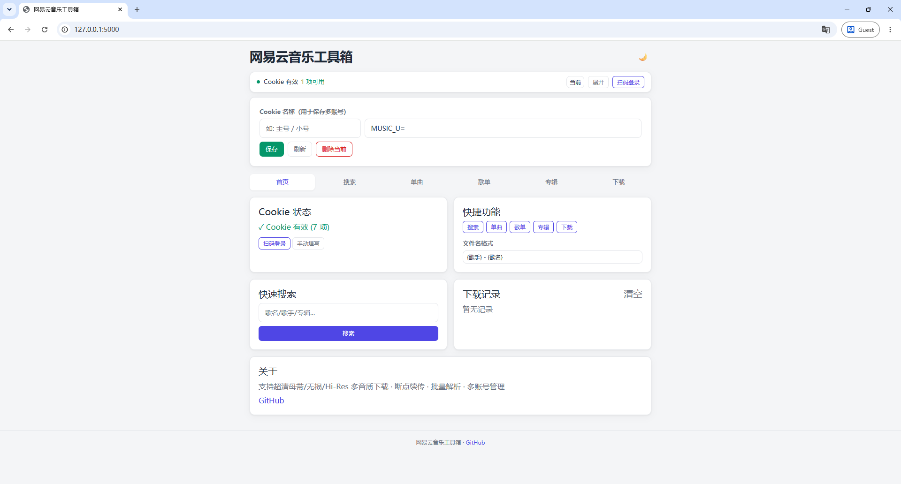
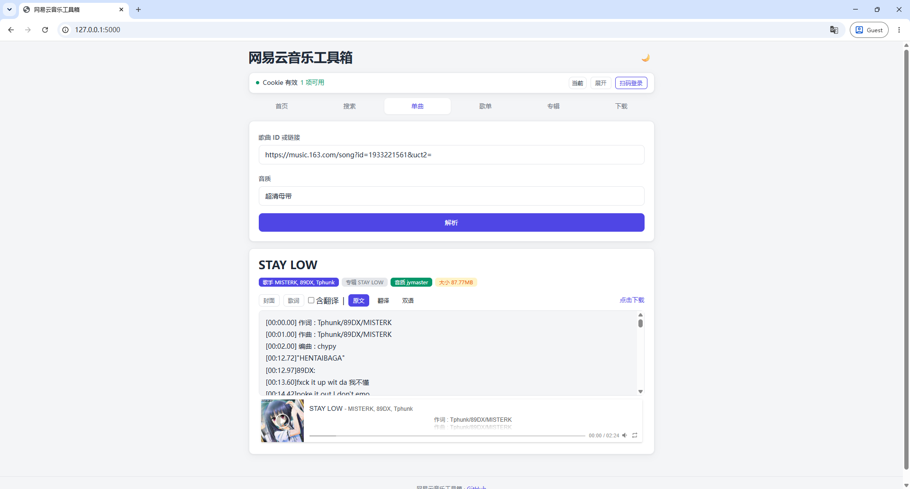
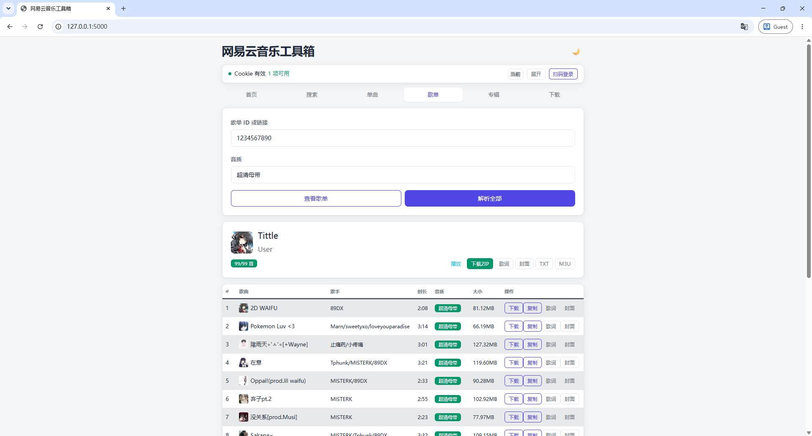

# 网易云音乐工具箱

<div align="center">


**基于 Flask + jQuery 的网易云音乐解析下载工具**

歌曲搜索 | 单曲解析 | 歌单专辑批处理 | 多音质下载 | 扫码登录

</div>

---

## ✨ 功能特性

### 🎵 核心功能
- **歌曲搜索**：关键词搜索，支持单曲/专辑/歌手/歌单四种类型
- **单曲解析**：获取歌曲详情、播放链接、歌词（支持原文/翻译/双语切换）
- **歌单处理**：查看、批量解析 URL、一键播放全部、批量下载 ZIP
- **专辑处理**：查看、批量解析 URL、批量下载 ZIP、封面/歌词导出
- **音乐下载**：单曲下载 + 歌单/专辑批量打包 ZIP，支持断点续传
- **扫码登录**：二维码登录，自动保存 Cookie，支持多账号切换

### 🎼 音质支持
| 参数 | 名称 | 需要 |
|------|------|------|
| `standard` | 标准音质 | - |
| `exhigh` | 极高音质 | VIP |
| `lossless` | 无损音质 | VIP |
| `hires` | Hi-Res | VIP |
| `dolby` | 杜比全景声 | SVIP |
| `sky` | 沉浸环绕声 | SVIP |
| `jyeffect` | 高清环绕声 | SVIP |
| `jymaster` | 超清母带 | SVIP |

### 🛠 工具功能
- **下载记录**：服务端持久化，支持历史重下
- **M3U 导出**：导出播放列表，可在 VLC / foobar2000 中播放
- **歌词下载**：单曲 LRC + 歌单/专辑批量 ZIP
- **封面下载**：单曲 + 歌单/专辑批量 ZIP
- **文件名模板**：下载文件命名格式可定制
- **速率限制**：内置请求限流，防止滥用



---

## 🚀 快速开始

### 环境要求
- Python 3.7+
- 网易云音乐账号（高音质需黑胶会员）

### 安装

```bash
git clone https://github.com/sarkewww/WyyDownload.git
cd WyyDownload
pip install -r requirements.txt
```

### 配置 Cookie

在项目根目录创建 `cookie.txt`，填入网易云音乐 Cookie。也可通过 Web 界面扫码登录自动保存。

> **获取 Cookie**：登录网易云音乐网页版 → F12 → Application → Cookies → 复制 `MUSIC_U` 等字段。

### 启动

```bash
python main.py
```

打开 http://localhost:5000

---

## 🔌 API 接口

**Base URL**: `http://localhost:5000`  
**响应格式**: `{"status": 200, "success": true, "message": "...", "data": ...}`

| 方法 | 路由 | 说明 |
|------|------|------|
| GET | `/health` | 健康检查 |
| POST | `/Search` | 搜索音乐（`keyword`, `type`, `limit`, `offset`） |
| POST | `/Song_V1` | 单曲解析（`url`, `level`） |
| GET/POST | `/playlist` | 歌单详情（`id`） |
| POST | `/playlist/batch` | 批量解析歌单 URL（`id`, `level`） |
| POST | `/playlist/download/batch/start` | 启动歌单批量下载 |
| GET | `/playlist/download/batch/progress/<id>` | 查询下载进度 |
| GET | `/playlist/download/batch/result/<id>` | 获取下载 ZIP |
| GET/POST | `/album` | 专辑详情（`id`） |
| POST | `/album/batch` | 批量解析专辑 URL |
| POST | `/album/download/batch/start` | 启动专辑批量下载 |
| GET/POST | `/download` | 单曲下载（`id`, `quality`） |
| GET/POST | `/lyric/download` | 下载 LRC 歌词 |
| POST | `/lyric/batch` | 批量获取歌词 JSON |
| POST | `/playlist/lyric/batch` | 批量下载歌单歌词 ZIP |
| POST | `/album/lyric/batch` | 批量下载专辑歌词 ZIP |
| POST | `/playlist/cover/batch` | 批量下载歌单封面 ZIP |
| POST | `/album/cover/batch` | 批量下载专辑封面 ZIP |
| GET/POST | `/cookie` | Cookie 管理 |
| GET/POST/DELETE | `/dl/history` | 下载记录管理 |
| POST | `/qr-login/start` | 生成登录二维码 |
| GET | `/qr-login/check/<key>` | 检查登录状态 |
| GET | `/api/info` | API 信息 |

---

## 📖 使用指南

### 仪表盘
首页显示 Cookie 状态、快速搜索、下载记录、多账号切换、文件名模板。

### 歌曲搜索
1. 选择搜索类型：单曲 / 专辑 / 歌手 / 歌单
2. 输入关键词，点击搜索
3. 单曲结果点击「解析」跳转解析页，「下载」跳转下载页
4. 专辑/歌单结果点击「查看」跳转对应页面自动加载

### 单曲解析
1. 输入歌曲 ID 或链接（支持 `163cn.tv` 短链）
2. 选择音质
3. 点击「解析」查看歌曲信息、在线播放、歌词显示
4. 支持原文/翻译/双语歌词切换



### 歌单 / 专辑
1. 输入 ID 或链接，点击「查看」浏览曲目
2. 点击「解析全部」批量获取所有歌曲的下载链接
3. 点击「播放全部」创建 APlayer 播放列表（自动加载歌词）
4. 点击「下载 ZIP」启动多线程批量下载，带进度条和失败重试



### 音乐下载
1. 输入歌曲 ID 或链接
2. 选择音质
3. 点击「下载」，支持断点续传
4. 下载记录自动保存，可随时重下

---

## 🗺 版本历史

### v2.4.6（当前）
- 修复 20+ bug：双层 JSON、空歌单崩溃、线程锁安全、Cookie 编码、QR 刷新泄漏、歌词翻译匹配、HTTP 重试、封面缓存、断点续传零字节保护
- 新增：速率限制、下载记录持久化、批量歌词加载、搜索防抖、二维码过期自动刷新
- 新增：杜比全景声 `dolby` 音质支持
- 新增：26 个单元测试（加密/响应/文件名/下载器）
- 前端：JS/CSS 静态资源本地化

### v2.2
- 批量下载线程安全问题修复（死锁、I/O 占锁、数据竞争）
- 专辑封面空 URL 判断修复
- 断点续传 `.part` 文件 total_size 恢复

### v2.1
- 搜索分页 offset 修复
- ZIP 文件名支持创建者
- HTTP 头 latin-1 中文编码修复

### v2.0
- 全新 UI：深色/浅色主题、Tab 切换、Toast 通知
- 批量下载 ZIP、取消任务
- M3U 播放列表导出
- 下载进度条（每文件 + 总体）
- 断点续传（.part 文件）

---

## 📝 技术栈

| 层 | 技术 |
|----|------|
| 后端 | Python 3.10 + Flask |
| 前端 | Bootstrap 5 + jQuery 3.7 + APlayer |
| 加密 | AES-ECB（eapi 加密） |
| 音频 | mutagen（MP3/FLAC/M4A 标签写入） |
| 测试 | unittest（26 用例） |

---

## 📄 许可证

本项目基于 [MIT License](LICENSE) 开源。

---

## 🙏 致谢

本项目基于 [Suxiaoqinx/Netease_url](https://github.com/Suxiaoqinx/Netease_url) 开发，感谢原作者 **苏晓晴（Suxiaoqinx）** 及所有贡献者。

v2.0 起由 sarkewww 持续维护，包括架构重构、bug 修复、性能优化和功能增强。
